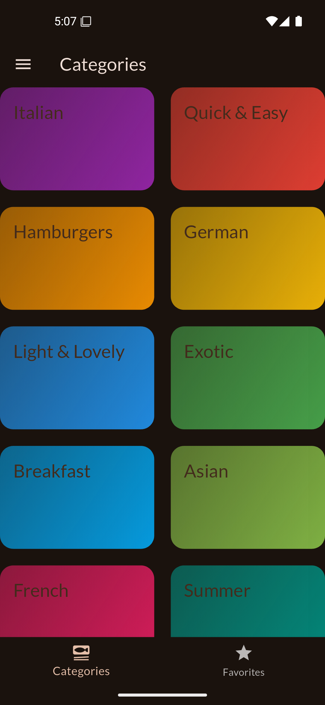
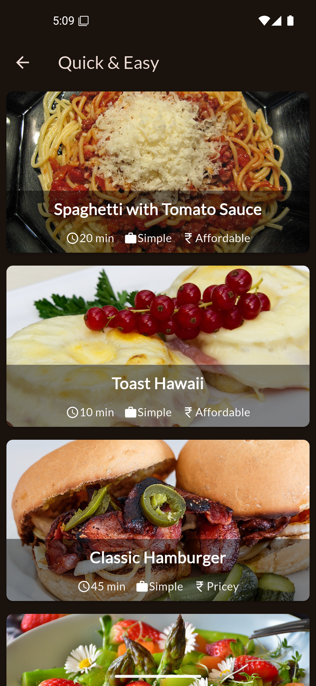
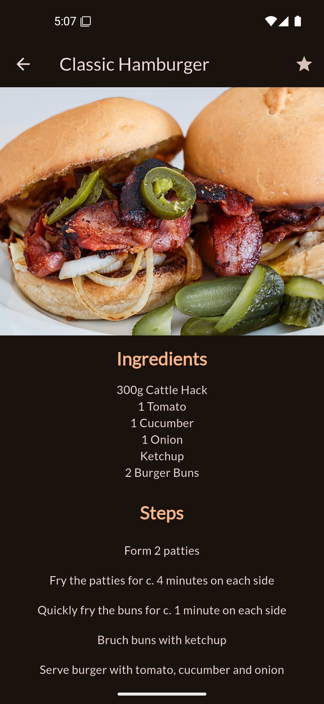
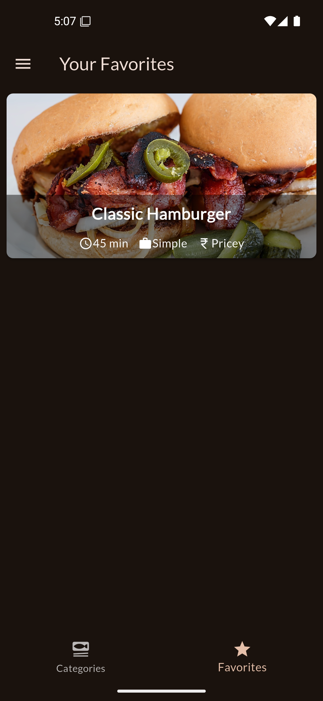
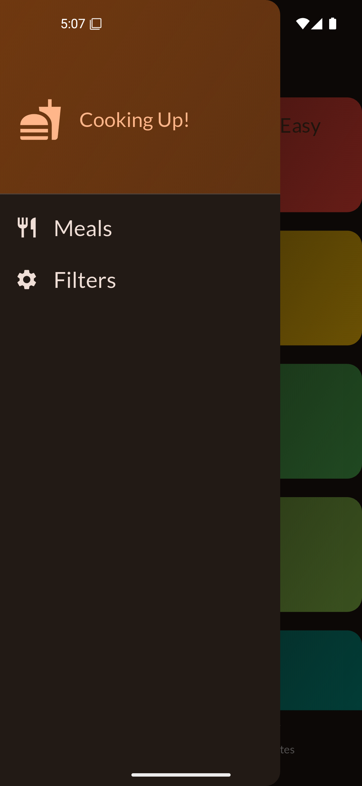

# 🍽️ Meals App  

A **Flutter-based meal recipe app** that helps users browse, filter, and favorite meals from different categories. Built with **Flutter Riverpod** for state management and a clean project structure.


## ✨ Features  

- **Browse Categories** – View a list of meal categories with appealing UI.  
- **View Meals** – Explore detailed meal recipes with ingredients and steps.  
- **Filter Meals** – Customize meal preferences (e.g., gluten-free, vegan).  
- **Favorite Meals** – Mark meals as favorites for quick access.  
- **Responsive UI** – Fully optimized for mobile devices.  


## 📸 Screenshots  
<p align="center">
    
    
      
    
    
    
</p>


## 📦 Dependencies  

| Package              | Purpose                                            |  
|----------------------|----------------------------------------------------|  
| `flutter_riverpod`   | State management for handling app logic.           |  
| `google_fonts`       | Custom fonts for a better UI experience.           |  
| `transparent_image`  | Displays placeholder images while loading content. |  
| `cupertino_icons`    | iOS-style icons for a modern interface.            |  

### Install dependencies using:  
```sh
flutter pub get
```


## 🛠 Installation

1. Clone the repository:

```sh
git clone https://github.com/your-username/meals-app.git   # Replace with your actual repository URL
```

2. Navigate to the project directory:

```sh
cd meals-app
```

3. Install dependencies:

```sh
flutter pub get
```

4. Run the App:

```sh
flutter run
```


## Project Structure
```bash
lib/
├── main.dart
├── data/
│   └── dummy_data.dart
├── models/
│   ├── category.dart
│   └── meal.dart
├── providers/
│   ├── favorites_provider.dart
│   ├── filters_provider.dart
│   └── meals_provider.dart
├── screens/
│   ├── categories_screen.dart
│   ├── filters_screen.dart
│   ├── meal_detail_screen.dart
│   ├── meals_screen.dart
│   └── tabs_screen.dart
└── widgets/
    ├── category_grid_item.dart
    ├── main_drawer.dart
    ├── meal_item.dart
    └── meal_item_trait.dart
```


## 💡 Usage Guide

- Browse Meals → Select a category to see available meals.
- View Recipe → Click on a meal to view its ingredients and steps.
- Favorite a Meal → Tap the heart icon to save meals for later.
- Apply Filters → Customize preferences for meal selection.

Enjoy cooking with Meals App! 🍲🔥